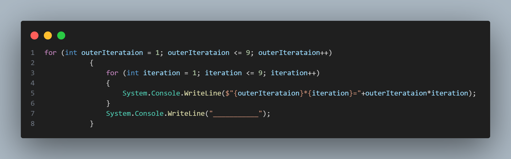

# Calculator

In this version of release,added choosing arithmetic operations by user such as:

* Addition [+].
* Subtraction [-].
* Mupltiplication [*].
* Division [/].
* Remainder Calculation [%]

If you want to see the old version , follow the [link](https://github.com/Stryker9898/Calculator/tree/releases/v1.0) !

## Demo

 

## Release Notes

### **[v2.0](https://github.com/Stryker9898/Calculator/tree/releases/v2.0)**

#### New Features
* You can show multiplication table
* Program to ask you to try again

### **[v1.0](https://github.com/Stryker9898/Calculator/tree/releases/v1.0)**
