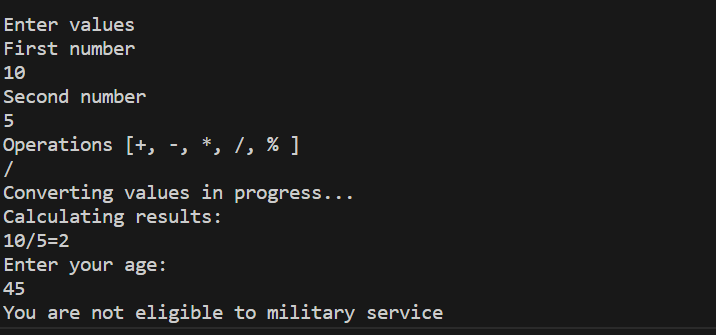

# Calculator

In this version of release,added choosing arithmetic operations by user such as:

* Addition [+].
* Subtraction [-].
* Mupltiplication [*].
* Division [/].
* Remainder Calculation [%]

If you want to see the old version , follow the [link](https://github.com/Stryker9898/Calculator/tree/releases/v1.0) !

## Demo

 